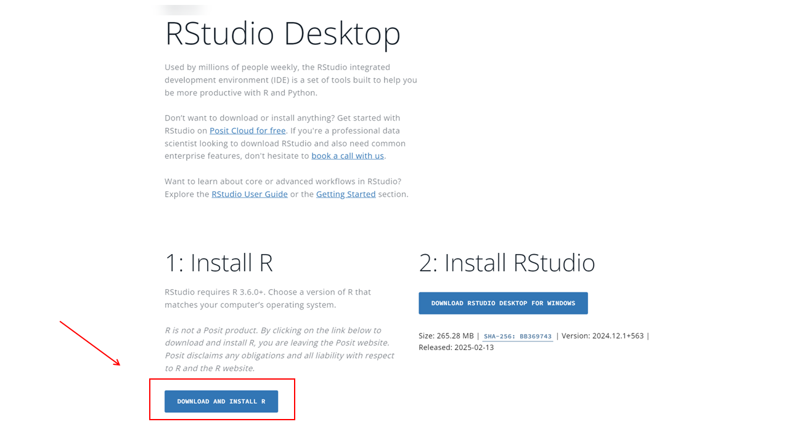
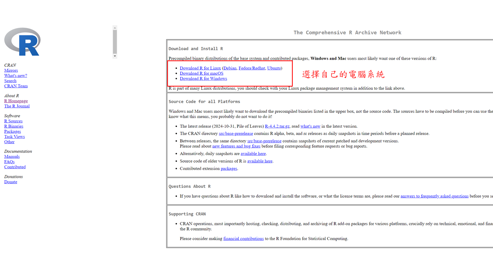
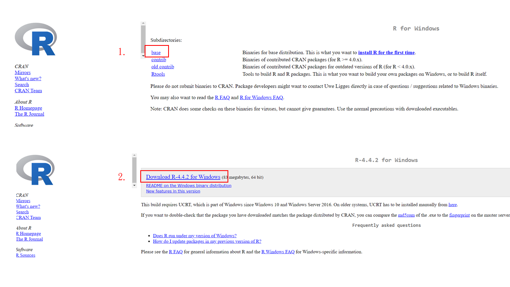
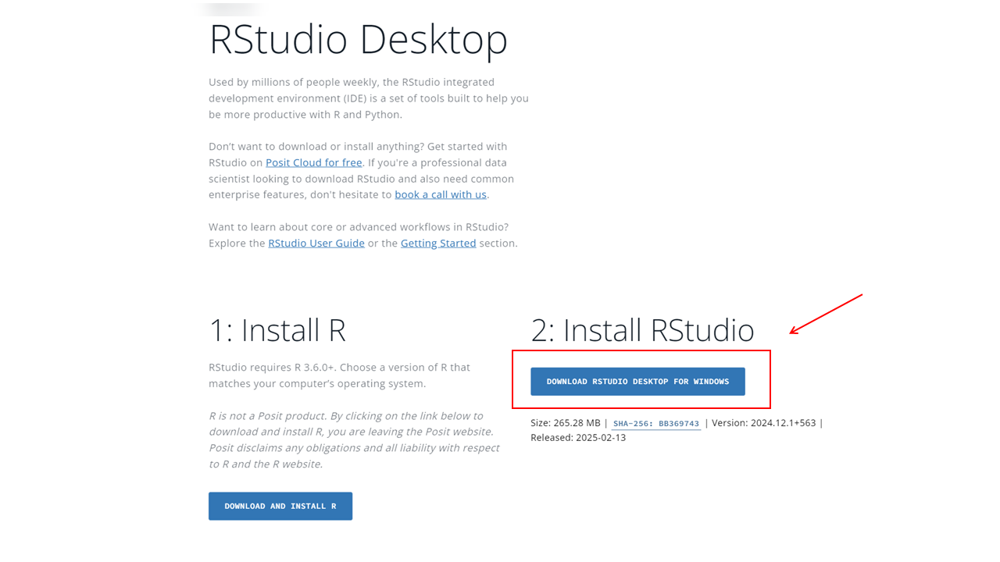

```{r}

```

layout: true
background-image: url(https://www.agec.ntu.edu.tw/uploads/asset/data/675f864c74ccc38a768f8254/%E6%9C%AA%E4%BE%86%E5%B1%95%E6%9C%9B%E5%9C%96%E7%89%87.png)
background-position: 98% 2%
background-size: 5%

```{r setup, include=FALSE}
library(knitr)
library(kableExtra)
library(dplyr)
library(ggplot2)
library(vistributions)
library(gginference)
setwd(dirname(rstudioapi::documentPath()))
options(htmltools.dir.version = FALSE)
knitr::opts_chunk$set(echo = TRUE, tidy = FALSE)
xaringanExtra::use_panelset()
xaringanExtra::use_clipboard()
xaringanExtra::use_extra_styles(hover_code_line = TRUE)
```
```{r xaringanExtra, echo = FALSE}
xaringanExtra::use_progress_bar(color = "#EFBE43", location = "bottom")
```
```{r xaringan-themer, include=FALSE, warning=FALSE}
library(xaringanthemer)
style_duo(
  # colors
  primary_color = "#FDF7E9",
  secondary_color = "#EFBE43",
  header_color = "#333333",
  text_color = "#333333",
  code_inline_color = colorspace::lighten("#333333"),
  text_bold_color = colorspace::lighten("#333333"),
  link_color = "#4466B0",
  title_slide_text_color = "#4466B0",

  # fonts
  header_font_google = google_font("Martel", "300", "400"),
  text_font_google = google_font("Lato"),
  code_font_google = google_font("Fira Mono")
)

style_extra_css(
  # 只針對段落 (p) 和列表 (li) 內的 `code`
  list(
    "p code, li code" = list(  
      "border" = "1px solid #F6DB96",
      "padding" = "2px 4px",
      "border-radius" = "4px"
      ),
    "ul ul" = list(
      "list-style-type" = "'▸'"  # 第二層使用三角形 (▸)
      ),
    "ul ul ul" = list(
      "list-style-type" = "'✔'"  # 第三層使用勾勾 (✔)
      ),
    # 置中
    ".middle_block" = list(
      "position" = "absolute",
      "top" = "50%",
      "left" = "50%", # 使與預設靠左距離相同
      "transform" = "translate(-50%, -50%)",
      "width" = "85%",              # 控制內文寬度（可調整）
      "text-align" = "left"         
      ),
    # 縮排
    ".indent" = list(
      "text-indent" = "2em"
      ),
    # 自動換行
    "pre code" = list(
      "white-space" = "pre-wrap",
      "word-wrap" = "break-word"
      ),
    "pre" = list(
      "border" = "none",
      "box-shadow" = "2px 2px 2px 2px #F7EEDA",
      "padding" = "0.1em",
      "background" = "none !important",
      "overflow-x" = "auto",
      "border-radius" = "1px"
      ),
    # 條列圖示顏色
    "li::marker" = list(
      "content" = "• ",
      "color" =  "#EFBE43"
      )
    )
  )

```


```{r, echo = FALSE}
options(servr.daemon = TRUE)
```

---
## TA

### 徐麗茵
- 學經歷

  - 流行病學與預防醫學研究所 生統組博士班
  
  - 資料科學博士學位學程

- 聯絡方式

  - leyin2030@gmail.com

- 課程負責項目

  - 批改正課作業
  
  - 批改期中期末試題

---
## TA

### 王俊欽
- 學經歷

  - 農業經濟學系研究所博士班
  
  - 統計碩士學位學程

- 聯絡方式

  - d14627001@ntu.edu.tw

- 課程負責項目

  - 實習課授課
  
  - 批改實習課作業與考試
  
---
## 實習課評分

實習課成績占學期總成績 20 %

- 出席（5%，共計 100 分）
  - <span style="line-height: 2;">每次實習課點名，請假寄信至 d14627001@ntu.edu.tw <span>
  - <span style="line-height: 2;font-weight: 700">前兩次請假不扣分，第三次開始扣出席分數 20 分 <span>
- 實習作業 2 次（5%，共計 100 分）
  - <span style="line-height: 2;">繳交內容：程式碼、報告or結果<span>
  - <span style="line-height: 2;">繳交方式：NTU COOL 線上繳交<span>
  - <span style="line-height: 2;font-weight: 700">作業遲交 24 小時扣 10 分，超過 24 小時不予補交<span>
  
---
## 實習課評分
實習課成績占學期總成績 20 %

- 上機考試（10%，共計 100 分）
  - <span style="line-height: 2;">考試日期：5/27 <span>
  - <span style="line-height: 2;">考試時間：13:20 - 15:00<span>
  - <span style="line-height: 2;">考試地點：博雅 408, 409 電腦教室<span>
  - <span style="line-height: 2;">考試方式：Open Book，可以攜帶隨身碟，禁止使用網路與電子產品<span>

- 更多細節如：繳交方式，電腦使用方法待考試前會再與大家說明。

---
## 實習課評分

- **填寫期末教學評鑑，期末分數總分加 20 分**

- office hour 時間
  - <span style="line-height: 2;">每週三 12:20 - 13:10、每週五 16:20 - 18:00，地點：與助教另約<span>
  - <span style="line-height: 2;">如有問題要詢問，請先將問題寄給助教<span>
  
.center[** 歡迎找厲害的同學討論或積極與助教約 office hour，但千萬不要抄襲拜託**]
.center[** 有任何問題請盡早寄信給助教 **]


---

# 這堂課主要重點

.pull-left[
<div style="display: flex; flex-direction: column; align-items: center; justify-content: center; height: 100%;">
  <p style="font-size: 36px; font-weight: bold;">程式語言</p>
  
</div>
]

.pull-right[
<div style="text-align: center;">
  <p style="font-size: 36px; font-weight: bold;">使用者介面</p>
  
</div>
]

???
圖片來源：[R](https://www.r-project.org/), [wikipedia](https://zh.wikipedia.org/wiki/File:RStudio_logo_flat.svg)
---
# R語言

.left-column[
  
]

.right-column[
 # 
 - <p style="font-size: 24px; font-weight: bold;">免費。</p>
 - <p style="font-size: 24px; font-weight: bold;">R 是一種統計與數據科學的程式語言。</p>
 - <p style="font-size: 24px; font-weight: bold;">與其他程式語言相同，內建許多數據分析、資料處理、機器學習函數。</p>
 - <p style="font-size: 24px; font-weight: bold;">適用於 Windows / Mac / Linux，並且可與 Python、C++、SQL 等語言整合。</p>
]
---
# RStudio

.left-column[
  
]

.right-column[
 # 
 - <p style="font-size: 24px; font-weight: bold;">RStudio 本身不是一種程式語言。</p>
 - <p style="font-size: 24px; font-weight: bold;">RStudio 是一個 IDE（開發環境），需要安裝 R 語言才能運行。</p>
 - <p style="font-size: 24px; font-weight: bold;">透過良好的使用者介面，讓 R 的開發更加方便。</p>
 - <p style="font-size: 24px; font-weight: bold;">支援 R Markdown、Shiny、Quarto 等工具，可用於報告撰寫和互動式應用開發。</p>
]

---

# R語言 vs. RStudio


```{r, echo=FALSE, results='hold'}
data <- data.frame(
  特色 = c("是什麼？", "是否可獨立運行？", "功能", "適用對象"),
  R = c("程式語言", "可以", "數據分析、機器學習", "R 使用者"),
  RStudio = c("開發環境 (IDE)", "不可以", "提供 GUI、Markdown、Shiny 支援", "想提升 R 開發體驗者")
)

kable(data, format = "markdown")
```
--

##### 你不會想只使用R語言來度過這學期的...

---

# Hello World!
要踏入R語言的世界，首先你得需要：


- 筆電、桌上型電腦(Windows、macOS、Linux)

--

- 可能不要是10年前的設備

--

- [R](https://posit.co/download/rstudio-desktop/) & [Rstudio](https://posit.co/download/rstudio-desktop/)

--

- ChatGPT / Gemini/ Claude

--

- 替代方案：[NTU VDI 雲端虛擬桌面](https://vdiqa.ntu.edu.tw/)


---
class: center, middle, inverse

## 下載 R & RStudio

---

# Hello R

[下載 R](https://posit.co/download/rstudio-desktop/)



---
# Hello R

[下載 R](https://posit.co/download/rstudio-desktop/)



---
# Hello R(Windows)

[下載 R](https://posit.co/download/rstudio-desktop/)



---
# Hello RStudio
[下載 RStudio](https://posit.co/download/rstudio-desktop/)


---

class: center, middle, inverse

### 謝謝
#### 下周見