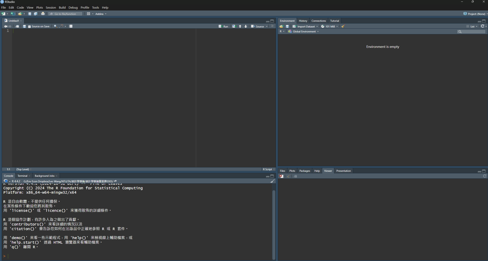
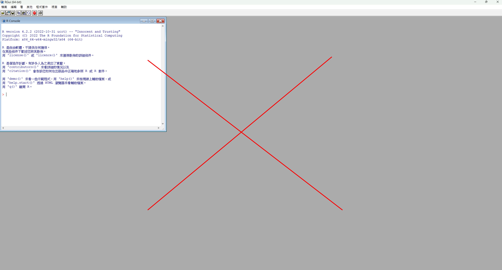
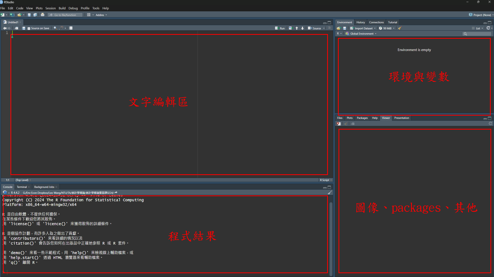
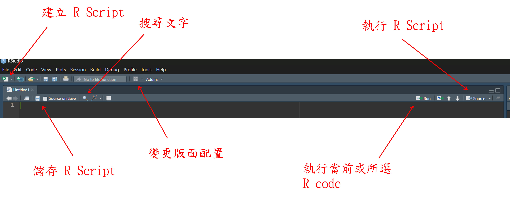
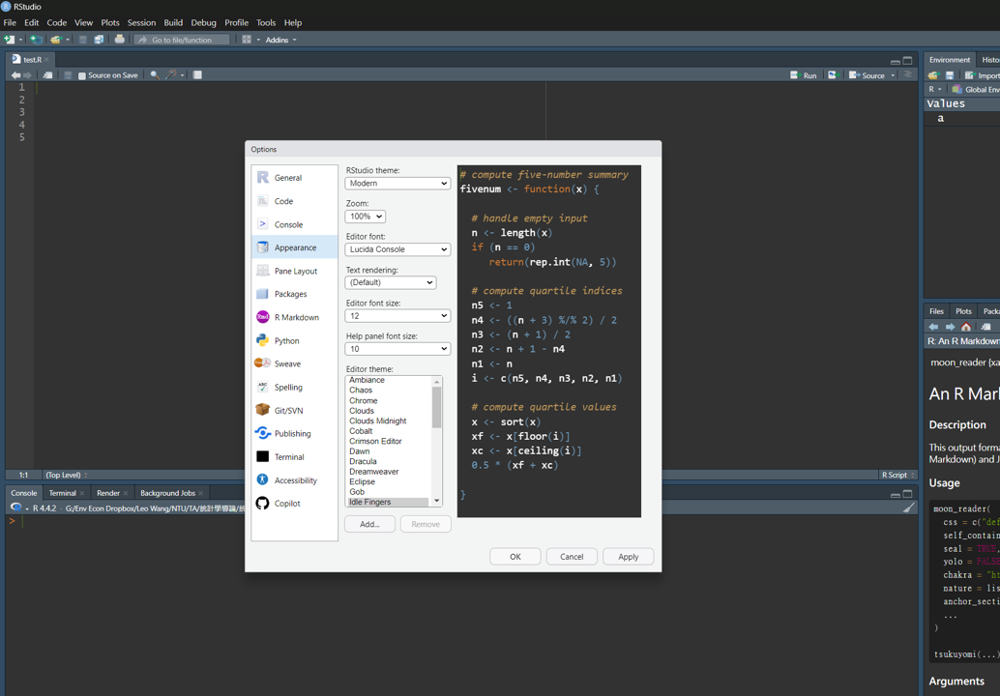
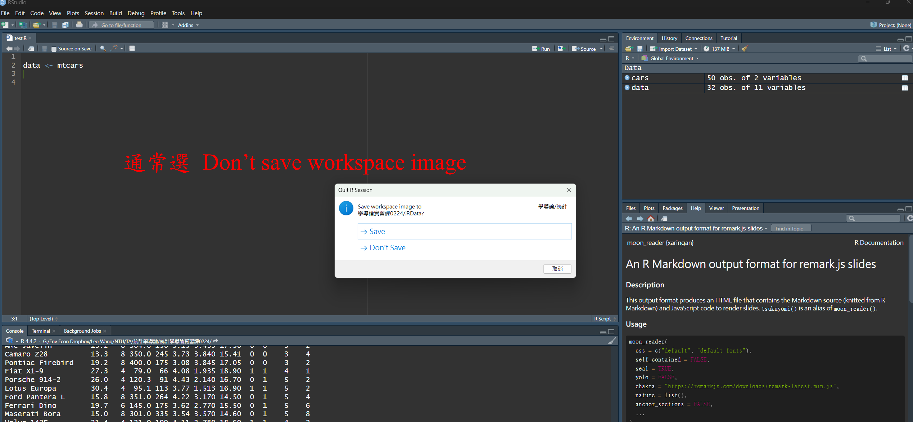

```{r}

```

layout: true
background-image: url(https://www.agec.ntu.edu.tw/uploads/asset/data/675f864c74ccc38a768f8254/%E6%9C%AA%E4%BE%86%E5%B1%95%E6%9C%9B%E5%9C%96%E7%89%87.png)
background-position: 98% 2%
background-size: 5%

```{r setup, include=FALSE}
library(knitr)
library(kableExtra)
library(dplyr)
library(ggplot2)
library(vistributions)
library(gginference)
setwd(dirname(rstudioapi::documentPath()))
options(htmltools.dir.version = FALSE)
knitr::opts_chunk$set(echo = TRUE, tidy = FALSE)
xaringanExtra::use_panelset()
xaringanExtra::use_clipboard()
xaringanExtra::use_extra_styles(hover_code_line = TRUE)
```
```{r xaringanExtra, echo = FALSE}
xaringanExtra::use_progress_bar(color = "#EFBE43", location = "bottom")
```
```{r xaringan-themer, include=FALSE, warning=FALSE}
library(xaringanthemer)
style_duo(
  # colors
  primary_color = "#FDF7E9",
  secondary_color = "#EFBE43",
  header_color = "#333333",
  text_color = "#333333",
  code_inline_color = colorspace::lighten("#333333"),
  text_bold_color = colorspace::lighten("#333333"),
  link_color = "#4466B0",
  title_slide_text_color = "#4466B0",

  # fonts
  header_font_google = google_font("Martel", "300", "400"),
  text_font_google = google_font("Lato"),
  code_font_google = google_font("Fira Mono")
)

style_extra_css(
  # 只針對段落 (p) 和列表 (li) 內的 `code`
  list(
    "p code, li code" = list(  
      "border" = "1px solid #F6DB96",
      "padding" = "2px 4px",
      "border-radius" = "4px"
      ),
    "ul ul" = list(
      "list-style-type" = "'▸'"  # 第二層使用三角形 (▸)
      ),
    "ul ul ul" = list(
      "list-style-type" = "'✔'"  # 第三層使用勾勾 (✔)
      ),
    # 置中
    ".middle_block" = list(
      "position" = "absolute",
      "top" = "50%",
      "left" = "50%", # 使與預設靠左距離相同
      "transform" = "translate(-50%, -50%)",
      "width" = "85%",              # 控制內文寬度（可調整）
      "text-align" = "left"         
      ),
    # 縮排
    ".indent" = list(
      "text-indent" = "2em"
      ),
    # 自動換行
    "pre code" = list(
      "white-space" = "pre-wrap",
      "word-wrap" = "break-word"
      ),
    "pre" = list(
      "border" = "none",
      "box-shadow" = "2px 2px 2px 2px #F7EEDA",
      "padding" = "0.1em",
      "background" = "none !important",
      "overflow-x" = "auto",
      "border-radius" = "1px"
      ),
    # 條列圖示顏色
    "li::marker" = list(
      "content" = "• ",
      "color" =  "#EFBE43"
      )
    )
  )

```


```{r, echo = FALSE}
options(servr.daemon = TRUE)
```

---
## 確保你現在看到的介面長這樣....
.panelset[
.panel[.panel-name[Look like...]
#### Rstudio
```{r echo = FALSE, out.width="80%", fig.align='center'}

```
]
.panel[.panel-name[Not like this...]
#### R
```{r echo = FALSE, out.width="80%", fig.align='center'}

```
]
]
---
class: center, middle, inverse

### RStudio UI 介紹 ！

---
# RStudio UI
RStudio 使用者介面主要分為四大區塊

```{r echo = FALSE, out.width="80%"}


```

---
# RStudio UI
```{r echo = FALSE, out.width="70%"}


```
- 建立新 R Script（Ctrl + Shift + N）

- 儲存（Ctrl + S）

- 搜尋（Ctrl + F）

- 執行當前行或所選擇的 code（Ctrl + Enter）

- 執行當前 R Script（Ctrl + Shift + Enter）

<div style="display: flex; justify-content: flex-end;">
.footnote[[更多快捷鍵請參考](https://support.posit.co/hc/en-us/articles/200711853-Keyboard-Shortcuts-in-the-RStudio-IDE)]</div>
---
# RStudio UI

Tools → Global Options... → Appearance

```{r echo = FALSE, out.width="70%"}


```

---
# RStudio UI
```{r echo = FALSE, out.width="100%"}


```
---
class: center, middle, inverse

### 正式開始 R programming !

#### （學習程式語言 google xxx CheatSheet 是你的好夥伴）

##### （<s>都 2026 年了，ChatGPT\Gemini\Claude 更是你的好夥伴</s>）

---
# Hello World

也許是你人生中第一支程式語言

```{r}
# 學習程式語言的超級老梗
print("Hello World!")
```
--

```{r}
# 
print("你好世界！")
```
--

- ＃ 符號可以在程式碼區域中加入註解（Ctrl + Shift + C）

--

- 編輯 R Script 時，不同意義的文字呈現不同顏色

---
# 語法（Syntax）

####注意！資料型態有不同的語法，輸入完記得執行（Run）你的程式碼。（Ctrl + Enter）
```{r results='hold'}
# 文字類型
"Hello World!"
'Hello World!'
```
- 字串（String）需使用單引號 ' 或雙引號 " 作區分（現階段兩者對各位來說無差異）

--
```{r results='hold'}
# 數字類型
666
```

- 沒什麼特別的地方，直接輸入就對了  

---
# 指令（Command）

#### 給予電腦指示，並執行特定的動作

- 通常為一個函數（function），其中可以輸入參數（argument）

- 如 `help()` 函數，可以幫助我們查詢各個指令的使用規則及參數設定

```{r results='hide', eval=FALSE}
# 查看 class 函數的使用方法
help(class)
```
- 也可以使用一個 `?` 放在函數前面查詢。

```{r results='hide', eval=FALSE}
# 查看 class 函數的使用方法
?typeof
```

---
# 資料型態（Data type）

#### 在 R 中，資料型態大致上可分為三種：character、numeric、logical。

可以用`class()`、`typeof()` 來辨別資料型態或結構

- `class()` 顯示一個物件（object）看起來是什麼樣子的型態。

- `typeof()` 顯示一個物件實際上被儲存在記憶體中的型態。

---
# 字串型資料（Character）

```{r}
# 文字型資料、字串
class("Hello World!")
typeof('你好世界！')
typeof('123456')
```
---
# 數值型資料（Numeric）
#### 數值型資料包括：double、integer

.panelset[
.panel[.panel-name[double]
```{r}
# 數值型資料、數字
class(0.1)
typeof(2)
```

]
.panel[.panel-name[integer]
整數（integer）需在數字後方加上 *"L"*
```{r}
typeof(12L)
```
```{r results='hide'}
0.2L
```
```{r echo=FALSE, warning=TRUE}
invisible(parse(text = "0.2L"))
```
]
]

---
# 邏輯值資料（Logical）
#### 邏輯值資料（logical）共有三種，分別為 `TRUE`、`FALSE`、`NA`，還有一個特別的未知型態 `NULL`。 
.panelset[
.panel[.panel-name[boolean]
#### 布林值（boolean）在任何程式語言中都是相當重要的資料型態，通常用於邏輯判斷式。
- 布林值共有兩種，分別為 `TRUE`、`FALSE`。 
```{r}
class(FALSE)
```
]
.panel[.panel-name[missing]
#### `NA` 意思為 non-available，通常用來表示缺失值（missing value）。

```{r}
class(NA)
```
- 當資料為 `NA` 時，這個值是存在且佔空間的，但無法得知資料的值（value）。
```{r}
length(NA)
```
]
.panel[.panel-name[undefined]
#### `NULL` 代表某個物件或結果根本不存在。
```{r}
class(NULL)
```
-  `NULL` 除了值是不存在之外，對 R 來說也是不佔空間的。
```{r}
length(NULL)
```
]

]

---
# 布林值（Boolean）
- 鍵入布林值（boolean）時需要全部使用大寫。
```{r}
TRUE
```
```{r error=TRUE}
True
```
- 可以用簡寫 `T` 與 `F` 替代（也要大寫）。
```{r}
T
```

---
# 資料型態（Data type）
```{r}
# 檢查資料型態
is.character("ABC")
is.numeric(123)
is.integer(1.2)
is.logical(F)
```

---
# 資料型態（Data type）
#### 你可能會想問，為什麼要特意分類出整數（integer）的數值型資料？原因在於電腦使用的進位方式與平常我們算數學的進位方式不一樣。

- 試想這個簡單的數學問題

```{r results='hide'}
0.1 + 0.2 == 0.3
```
--
```{r echo=F}
0.1 + 0.2 == 0.3
```
--
- 實際上 0.1 是一個循環小數，因此 double 的數學計算儘管可以使計算範圍變得廣泛，但會犧牲掉精準性。

```{r}
sprintf("%.17f", 0.1)
```
--

- **實務上或課程需求不太容易遇到這樣的情況，還是可以無腦使用 double 即可。**

---
# 資料型態（Data type）
#### 有些資料表面上看起來像字串（character），但底層並不是字串。
.panelset[
.panel[.panel-name[factor]
```{r}
# 類別變數
x <- factor(c("apple", "banana", "apple")); print(x)
```
```{r}
class(x)
```
```{r}
typeof(x)
```
]
.panel[.panel-name[time]
```{r}
y <- Sys.Date(); print(y)
```
```{r}
class(y)
```
```{r}
typeof(y)
```
]
]


---
class: center, middle, inverse

### 謝謝
#### 下周見