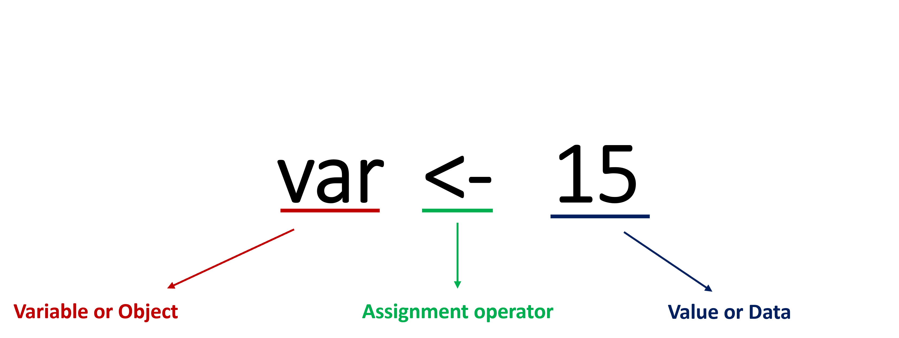
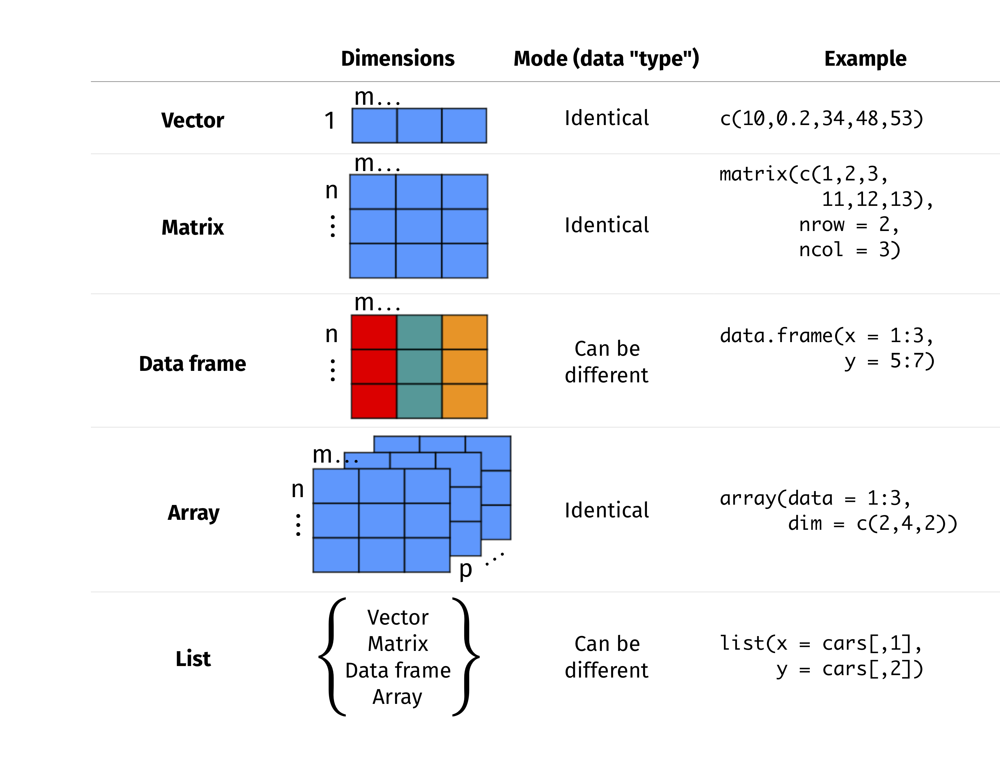

```{r}

```

layout: true
background-image: url(https://www.agec.ntu.edu.tw/uploads/asset/data/675f864c74ccc38a768f8254/%E6%9C%AA%E4%BE%86%E5%B1%95%E6%9C%9B%E5%9C%96%E7%89%87.png)
background-position: 98% 2%
background-size: 5%

```{r setup, include=FALSE}
library(knitr)
library(kableExtra)
library(dplyr)
library(ggplot2)
library(vistributions)
library(gginference)
setwd(dirname(rstudioapi::documentPath()))
options(htmltools.dir.version = FALSE)
knitr::opts_chunk$set(echo = TRUE, tidy = FALSE)
xaringanExtra::use_panelset()
xaringanExtra::use_clipboard()
xaringanExtra::use_extra_styles(hover_code_line = TRUE)
```
```{r xaringanExtra, echo = FALSE}
xaringanExtra::use_progress_bar(color = "#EFBE43", location = "bottom")
```
```{r xaringan-themer, include=FALSE, warning=FALSE}
library(xaringanthemer)
style_duo(
  # colors
  primary_color = "#FDF7E9",
  secondary_color = "#EFBE43",
  header_color = "#333333",
  text_color = "#333333",
  code_inline_color = colorspace::lighten("#333333"),
  text_bold_color = colorspace::lighten("#333333"),
  link_color = "#4466B0",
  title_slide_text_color = "#4466B0",

  # fonts
  header_font_google = google_font("Martel", "300", "400"),
  text_font_google = google_font("Lato"),
  code_font_google = google_font("Fira Mono")
)

style_extra_css(
  # 只針對段落 (p) 和列表 (li) 內的 `code`
  list(
    "p code, li code" = list(  
      "border" = "1px solid #F6DB96",
      "padding" = "2px 4px",
      "border-radius" = "4px"
      ),
    "ul ul" = list(
      "list-style-type" = "'▸'"  # 第二層使用三角形 (▸)
      ),
    "ul ul ul" = list(
      "list-style-type" = "'✔'"  # 第三層使用勾勾 (✔)
      ),
    # 置中
    ".middle_block" = list(
      "position" = "absolute",
      "top" = "50%",
      "left" = "50%", # 使與預設靠左距離相同
      "transform" = "translate(-50%, -50%)",
      "width" = "85%",              # 控制內文寬度（可調整）
      "text-align" = "left"         
      ),
    # 縮排
    ".indent" = list(
      "text-indent" = "2em"
      ),
    # 自動換行
    "pre code" = list(
      "white-space" = "pre-wrap",
      "word-wrap" = "break-word"
      ),
    "pre" = list(
      "border" = "none",
      "box-shadow" = "2px 2px 2px 2px #F7EEDA",
      "padding" = "0.1em",
      "background" = "none !important",
      "overflow-x" = "auto",
      "border-radius" = "1px"
      ),
    # 條列圖示顏色
    "li::marker" = list(
      "content" = "• ",
      "color" =  "#EFBE43"
      )
    )
  )

```


```{r, echo = FALSE}
options(servr.daemon = TRUE)
```
---

# 四則運算

簡單的四則運算就跟平常一樣，記得執行（run）。

```{r}
# 加法
1 + 1
# 乘法
3 * 2
# 除法
8 / 2
```
---
# 運算子（Operators）

.pull-left[
```{r, echo=FALSE, results='asis'}
math_ops <- data.frame(
  數學運算子 = c(" +", " -", " *", " /", " ^", " %%", " %/%"),
  說明 = c("加法", "減法", "乘法", "除法", "次方", "取餘數", "除法取整"),
  範例 = c("x + y", "x - y", "x * y", "x / y", "x^y", "x %% y", "x %/% y"))
kable(math_ops, format = "html", escape = FALSE) %>%
    kable_styling(full_width = TRUE, position = "center")
```
]

.pull-right[
```{r, echo=FALSE, results='asis'}
logic_table <- data.frame(
    邏輯運算子 = c(" ==", " !=", " !", " >", " <", " >=", " <=", " &", " |", " &&", " ||"),
    說明 = c("等於", "不等於", "非", "大於", "小於", "大於或等於", "小於或等於",
            "且（向量）", "或（向量）", "且（元素）", "或（元素）"),
    範例 = c("x == y", "x != y", "!x", "x > y", "x < y", "x >= y", "x <= y", "x > 1 & y < 5", "x > 1 | y < 5", "x > 1 && y < 5", "x > 1 || y < 5"))

kable(logic_table, format = "html", escape = FALSE) %>%
    kable_styling(full_width = TRUE, position = "center")    

```
]
---
# 運算子（Operators）

```{r results='asis'}
# 計算 1 加到 10 的和
(1 + 10) * 10 / 2
# 10 除以 3 的餘數
10 %% 3
# 根號 2
2^(1/2)
```
---
# 運算子（Operators）
```{r error=TRUE}
# 邏輯判斷
1 + 1 = 3

1 + 1 == 3

9 > 8 

"我" != "你"
```

---
# 運算子（Operators）
#### 運算子也是有先後順序，就如同先乘除後加減
```{r}
1 + 2 * 2 

1 + 2 * 2 ** 3 

```
---
# 運算子（Operators）
#### 邏輯運算子的規則
```{r}
T & T

# AND 中，只要有 FALSE 就是 FALSE
T & F

# OR 中，只要有 TRUE 就是 TRUE
T | F

F | F & T
```

---
# 變數（Variables）

#### .center[給定一個變數（容器）名稱，賦予其一個值]

```{r echo = FALSE, out.width='65%', fig.align='center'}

```
- 建立一個名為 var 的變數，並賦予其值 5 。

- 使用 ` <- ` （ Alt + - ）賦予變數值之後，便可以在 Enviroment 區塊中查看。
---
# 變數（Variables）

``` {r results='hold'}
# 分別賦予 name 與 height 值
name <- "Leo"
height = 175
```
--

- 將右邊的值（Leo）儲存在左邊的變數（name）裡

- ` <- ` 與 ` = ` 都可以賦予變數值（通常會使用 ` <- `）

- assign 變數時不需要宣告資料型態

--

``` {r results='hold'}
# 此時 R 已經知道 name 與 height 的值是什麼了
name
height
```
---
# 變數（Variables）
#### 變數命名時：
- 大小寫分明、不能有空格

- 命名清晰明瞭，適當使用簡寫（如：var）

- 字數太長、單字兩個以上，可用底線 ` _ ` 、小數點 ` . ` 連接（如：male_height、my.var）

- 避免使用 R 本身已有的函數名稱作為變數名稱（如：print、sum）

- 盡量以英文字母開頭，數字強烈建議不要，中文就別了拜託

- 保留字不可用（如：if、else、for）


---
# 課堂練習

.panelset[
.panel[.panel-name[Question]
```{r eval=F}
# Tim is 175 tall and weights 70kg. Calculate his BMI.
height <- 
weight <- 
bmi <- 
print(bmi)

# check data type of bmi

```
]
.panel[.panel-name[Answer]
```{r}
# Tim is 175 tall and weights 70kg. Calculate his BMI.
height <- 175
weight <- 70
bmi <- weight / (height / 100 * height * 0.01)
print(bmi)

# check data type of bmi
class(bmi)
```
]
]

---
# 課堂練習

.panelset[
.panel[.panel-name[Question]
```{r eval=F}
# The annual interest rate is 6%. If you deposit 1,000 every month, what will the future value be after two years?
monthly_saving <- 
rate <- 
year <- 
future_value <- 

print(future_value)
```
]
.panel[.panel-name[Answer]
```{r}
# The annual interest rate is 6%. If you deposit 1,000 every month, what will the future value be after two years?
monthly_saving <- 1000 # deposit $1000 monthly
rate <- 0.06           # annual interest rate 6 %
year <- 2              # save 2 periods
future_value <- monthly_saving * (1 - (1 + rate / 12)^(year * 12)) / 
  (1 - (1 + rate / 12)) * (1 + rate / 12) 

print(future_value)
```
]
]

---
## Recall 資料型態（Data Type）

#### 前面提到資料型態（Data Type），是指單一資料儲存最小單位的 "型態"。
e.g. character, numeric, logical
```{r results='hold'}
# 單一資料
print("5")
print(5)
```
```{r results='hold'}
# 單一資料的資料型態
typeof("5")
typeof(5)
```
---
## 資料結構（Data Structure）

```{r echo = FALSE, out.width='70%', fig.align='center'}

```

<p style="text-align: center;">圖片來源：<a href="https://r.qcbs.ca/workshop01/">QCBS R Workshop</a></p>


---
## 資料結構：向量
  
#### 單一資料組合後的樣子，稱為資料結構（Data Structure）。
e.g. vector, matrix, data frame, list
  
  
- 使用 `c()` 建立一個向量（vector）。
``` {r}
num <- c(1, 2, 3, 4, 5)
```

#### vector 屬於一維資料，且資料內容必須為相同 "資料型態"。
``` {r}
typeof(num)
```


---
## 資料結構：向量

#### 向量有許多屬性：名稱、長度、索引值...
```{r}
height <- c(158, 186, 161, 157, 169)
```
- `str()` 以顯示物件結構、 `length()` 以取得向量長度。
```{r results='hold'}
str(height)
length(height)
```

- `names()` 以命名向量或是其他物件。

```{r}
names(height) <- c("Chloe", "Leo", "Sandy", "Irene", "Cindy")
print(height)
```

---

## 索引值

- 索引值（index），可以理解為資料所在位置，可以使用 `[所在位置]` 來尋找。 
```{r results='hold'}
height[2]
height[1:3] # : 可以取得連續數列
height[-5] # 負號可以移除該索引值
```
- 變數（Variable）也可以作為索引值放入中括號 `[ ]` 內。
```{r results='hold'}
fifth <- 5
height[fifth]
```

---

## 索引值

- 也可以將資料名稱作為索引值（index）。
```{r results='hold'}
height["Irene"]
height[c("Chloe", "Sandy")] # 選取多個資料，要以 vector 表示。
```

--

- 當然，布林值（boolean）也可以作為索引值（index）。
```{r results='hold'}
weight <- c(40, 43, 70, 52, 48)
weight[c(T, F, F, T, T)]
```
#### 注意！使用布林值作為索引時，布林值長度必須與向量長度相同。
---
## 資料結構：向量（類別變數）
#### 類別 （factor）變數也屬於一維資料，但多了類別的屬性。
```{r results='hold'}
gender <- factor(c("female", "male", "female", "female", "female"))
levels(gender)
```
- 類別變數，有先後順序的關係，`sort()` 可以排序變數。
```{r results='hold'}
sort(gender)
```
---

## 資料結構：矩陣

#### 矩陣（matrix）為二維資料，與向量相同，矩陣內資料也須為相同 "資料型態"。
```{r}
m1 <- matrix(c(height, weight), nrow = 2, ncol = 5, byrow = T)
m1
```
- `rownames()` 與 `colnames()` 可以對矩陣的列、行命名。
```{r results='hold'}
rownames(m1) <- c("height", "weight")
colnames(m1) <- c("Chloe", "Leo", "Sandy", "Irene", "Cindy")
m1
```
---
## 資料結構：矩陣
#### 因為矩陣為二維資料，與向量不同，使用 `[列, 行]` 作為索引值尋找資料。 
```{r}
m1[1, 2] # 尋找 Leo 身高
```
- 當索引位置為空值時，預設為全部
```{r}
m1[1, ] # 第一行（first row）
```
- 與向量相同，也可以用列、行名稱作為索引值放入中括號 `[列, 行]` 內。
```{r}
m1["weight", "Cindy"]
```

---
## 資料結構：Data frame
#### Data frame 與矩陣同為二維資料，但 Data frame 內可存在不同 "資料型態"。
```{r}

df <- data.frame(
  name = c("Chloe", "Leo", "Sandy", "Irene", "Cindy"),
  gender = c("female", "male", "female", "female", "female"), 
  height = c(158, 186, 161, 157, 169),
  weight = c(40, 43, 70, 52, 48))
df
```

```{r results='hold'}
typeof(df[, "name"])
typeof(df[, "height"])
```
---
## 資料結構：Data frame

Data frame 索引值用法大致與矩陣相同，可以用數字或字串作為索引值。

```{r results='hold'}
df[2, 1]
df[2:4, "name"]
```

** 處理二維資料時，必須注意資料結構的呈現！ **
```{r results='hold'}
df[, c("height", "weight")]
```
---
## 資料結構：Data frame

#### 除了 `[列, 行]` 索引值以外，Data frame 可以用 `$` 符號作為"行"的索引方式。
```{r results='hold'}
df$weight
```
- `$` 符號僅能選擇 Data frame 其中一行。

- 使用 `$` 符號直接輸入變數名稱，**不需加上 `""`**，但加了也不會有 error。

- 輸出格式為向量（Vector）。

這時候就可以搭配 `mean()` 、 `sum()` 查看 Data frame 基本統計值。
```{r results='hold'}
mean(df$weight)
sum(df$height)
```

---
## HW1 說明
#### HW1繳交方式：
- **於 NTU COOL 線上繳交。**

- **繳交格式：學號_hw1.R。**
  

#### HW1繳交期限：
- **2026-04-01 13:20**

- **實習課作業遲交 24 小時內扣 10 分，超過時間則視為 0 分。**


---
class: center, middle, inverse

### 謝謝
#### 下周見