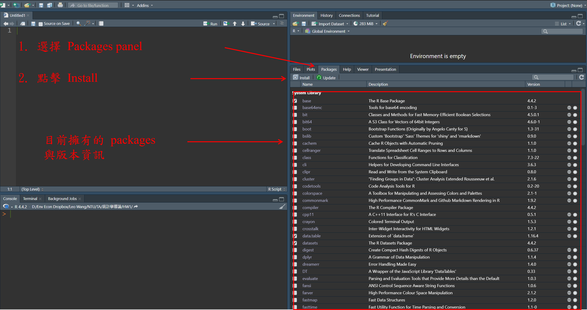
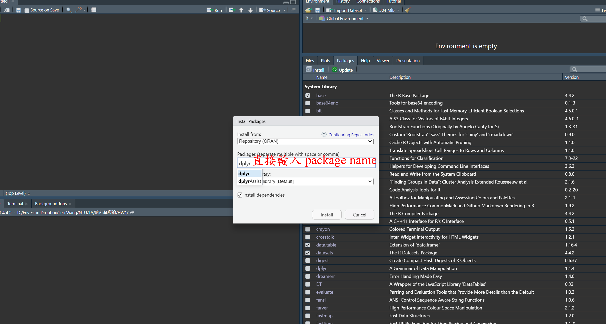

```{r}

```

layout: true
background-image: url(https://www.agec.ntu.edu.tw/uploads/asset/data/675f864c74ccc38a768f8254/%E6%9C%AA%E4%BE%86%E5%B1%95%E6%9C%9B%E5%9C%96%E7%89%87.png)
background-position: 98% 2%
background-size: 5%

```{r setup, include=FALSE}
library(knitr)
library(kableExtra)
library(dplyr)
library(ggplot2)
library(vistributions)
library(gginference)
setwd(dirname(rstudioapi::documentPath()))
options(htmltools.dir.version = FALSE)
knitr::opts_chunk$set(echo = TRUE, tidy = FALSE)
xaringanExtra::use_panelset()
xaringanExtra::use_clipboard()
xaringanExtra::use_extra_styles(hover_code_line = TRUE)
```
```{r xaringanExtra, echo = FALSE}
xaringanExtra::use_progress_bar(color = "#EFBE43", location = "bottom")
```
```{r xaringan-themer, include=FALSE, warning=FALSE}
library(xaringanthemer)
style_duo(
  # colors
  primary_color = "#FDF7E9",
  secondary_color = "#EFBE43",
  header_color = "#333333",
  text_color = "#333333",
  code_inline_color = colorspace::lighten("#333333"),
  text_bold_color = colorspace::lighten("#333333"),
  link_color = "#4466B0",
  title_slide_text_color = "#4466B0",

  # fonts
  header_font_google = google_font("Martel", "300", "400"),
  text_font_google = google_font("Lato"),
  code_font_google = google_font("Fira Mono")
)

style_extra_css(
  # 只針對段落 (p) 和列表 (li) 內的 `code`
  list(
    "p code, li code" = list(  
      "border" = "1px solid #F6DB96",
      "padding" = "2px 4px",
      "border-radius" = "4px"
      ),
    "ul ul" = list(
      "list-style-type" = "'▸'"  # 第二層使用三角形 (▸)
      ),
    "ul ul ul" = list(
      "list-style-type" = "'✔'"  # 第三層使用勾勾 (✔)
      ),
    # 置中
    ".middle_block" = list(
      "position" = "absolute",
      "top" = "50%",
      "left" = "50%", # 使與預設靠左距離相同
      "transform" = "translate(-50%, -50%)",
      "width" = "85%",              # 控制內文寬度（可調整）
      "text-align" = "left"         
      ),
    # 縮排
    ".indent" = list(
      "text-indent" = "2em"
      ),
    # 自動換行
    "pre code" = list(
      "white-space" = "pre-wrap",
      "word-wrap" = "break-word"
      ),
    "pre" = list(
      "border" = "none",
      "box-shadow" = "2px 2px 2px 2px #F7EEDA",
      "padding" = "0.1em",
      "background" = "none !important",
      "overflow-x" = "auto",
      "border-radius" = "1px"
      ),
    # 條列圖示顏色
    "li::marker" = list(
      "content" = "• ",
      "color" =  "#EFBE43"
      )
    )
  )

```


```{r, echo = FALSE}
options(servr.daemon = TRUE)
```

---
## 套件（package）
####  R 中本身自帶許多基礎（base）函數
```{r eval = FALSE}
library(help = "base")
```
####  安裝套件（package）可以使用其他官方與第三方作者的函數

- 大數據處理
 - <span style="line-height: 2;">`dplyr`</span>
 - <span style="line-height: 2;">`data.table`</span>
- 資料視覺化
 - <span style="line-height: 2;">`ggplot2`</span>
- 機器學習
 - <span style="line-height: 2;">`randomForest`</span>
 - <span style="line-height: 2;">`xgboost`</span>
---
## 套件（package）
<p style="text-align: center;"> Packages → Install </p>
.pull-left[
```{r echo = FALSE, out.width="130%", fig.align='center'}

```
]
.pull-right[
```{r echo = FALSE, out.width="130%", fig.align='center'}

```
]
---
## 套件（package）
#### 從 CRAN 使用 `install.packages()` 安裝（官方，最常使用）
```{r eval=FALSE}
install.packages("readr")
```
- package 名稱記得使用字串。

#### 從 [GitHub]("https://github.com/") 使用 `devtools` 安裝
```{r eval=FALSE}
devtools::install_github("tidyverse/ggplot2")
```
  
#### 其他安裝相關指令
```{r eval=FALSE, results='asis'}
# 查看已安裝套件
installed.packages()
# 更新已安裝套件
update.packages()
```
---
## 套件（package）
#### 使用 `library()` 呼叫套件使用
```{r eval=FALSE, result='asis'}
library("readr")
library(readr)
```
- `library` 套件時，套件名稱可以用字串或是**直接輸入**。

#### 使用 `ls()` 查看套件（packages）有哪些指令（commands）可以用。
```{r eval=FALSE}
ls('package:readr')
```
  
---
## CRUD
.middle_block[
- 學習完 R 中大部分資料型態與結構後，在進行資料分析前，需要了解如何與手上的資料進行互動。

  - 建立資料（Create）

  - 讀取資料（Read）

  - 更新資料（Update）

  - 刪除資料（Delete）

- **搞懂 C、R、U、D 四個基礎技能後，才能更有效的提升資料分析的能力。**
]
---
## 建立資料（Create）

#### 從外部環境導入資料

- 引用必要套件，如：`readxl`、`readr`

- 設定好你的工作路徑 `setwd()`，預設為 R file 儲存的位置

- 確認路徑有包含資料檔案類型附檔名（.xlsx, .csv, .json, .dta）


```{r results='hide'}
library(readr)
# "你的工作路徑/檔案名稱.副檔名"
df <- read_csv("./CASchools.csv")
```
- `.` 可以取代 working directory，即 `read.csv("./CASchools.csv")` 等同於

  `read.csv("C:/Users/user/Downloads/CASchools.csv")`  

- **上述程式碼所有路徑中，記得將反斜線 `\` 改為正斜線 `/` 或 `\\`**

- 如果你將資料與R file 儲存在同個路徑，也可以直接不輸入任何路徑

  `read.csv("CASchools.csv")` 。

---
## 建立資料（Create）
#### 讀取檔案（Read），進行資料分析之前可以先大致理解資料內容。
The [CASchools](https://www.rdocumentation.org/packages/AER/versions/1.2-14/topics/CASchools) data used here are from all 420 K-6 and K-8 |districts in California with data available for 1998 and 1999.

- district : character. District code.
- school : character. School name.
- county : factor indicating county.
- grades : factor indicating grade span of district.
- students : Total enrollment.
- teachers : Number of teachers.
- calworks : Percent qualifying for CalWorks (income assistance).
- lunch : Percent qualifying for reduced-price lunch.
- computer : Number of computers.
- expenditure : Expenditure per student.
- income : District average income (in USD 1,000).
- english : Percent of English learners.
- read : Average reading score.
- math : Average math score.

---
## 建立資料（Create）
- `nrow()` 、 `ncol()` 可以查看 data frame 的列與欄數。
```{r}
nrow(df)
ncol(df)
```

- `head()`、 `tail()` 可以查看 data frame 的前面、倒數六列。
```{r results='hide'}
head(df)　# 前面 6 
tail(df) # 倒數 6 
```

---
## 建立資料（Create）
- 使用索引值（index）查看變數的資料型態
```{r}
class(df$district)
```

- `names()` 可以列出變數名稱
```{r}
names(df)
```

- `summary()` 可以快速獲得各變數簡單敘述統計
```{r results='hide'}
summary(df)
```

---
## 讀取資料（Read）
#### 各種基本的敘述統計：
- `sum(x)` 回傳 x 的總和

- `mean(x)` 回傳 x 的算術平均數

- `median(x)` 回傳 x 的中位數

- `var(x)`、`sd(x)` 回傳 x 的變異數、標準差

- `range(x)` 回傳 x 的最小與最大值

- `length(x)` 回傳 x 的長度（數量）

- `unique(x)` 回傳 x 的唯一值

---
## 讀取資料（Read）

.middle_block[
#### 讀取資料主要分為兩種：選擇、篩選，不使用任何套件（packages）的情況下可以用索引值（index）與邏輯運算子達成，格式大致為 `data[條件, 欄位名稱或索引值]`。

- 選擇資料 `data[, 欄位名稱或索引值]`
```{r results='hide'}
student <- df$students # 選擇 student 欄位
school_info <- df[, c('school', 'students')]# 選擇 school,student 欄位
school_info <- df[, c(3, 6)] # 選擇 school,student 欄位, index
```
- **注意選擇資料後存在不同資料型態。**
]

---
## 讀取資料（Read）

.middle_block[

- 單一條件篩選 `data[條件, ]`
```{r results='hide'}
LA <- df[df$county == "Los Angeles", ] # 篩選 LA 的學校
```
- 多條件篩選
```{r results='hide'}
LA <- df[df$county == "Los Angeles" & df$students > 5000, ] 
```

- 同時選擇與篩選 `data[條件, 欄位名稱或索引值]`
```{r results='hide'}
LA_school_info <- df[df$county == "Los Angeles", c(3, 6)] 
```
]

---
## 讀取資料（Read）
.middle_block[
#### `subset()` 函數也可以完成大部分讀取資料（Read）的任務
```{r results='hide'}
subset(df, select = 3)
subset(df, select = c('school', 'students'))
```
#### 篩選條件時只需輸入變數名稱
```{r results='hide'}
subset(df, county == "Los Angeles", select = 3)
subset(df, county == "Los Angeles" & students > 5000,
       select = c('school', 'students'))
```
]

---
## 課堂練習
#### Select the schools that do not have computers from the `df`, along with the counties they are located in.
.panelset[
.panel[.panel-name[Question]
```{r eval=F}
df[df$`variable` == ?, c('variable', 'variable')]
```
]
.panel[.panel-name[Answer]
```{r}
df[df$computer == 0, c('school', 'county')]
```
]
]

---
## 更新資料（Update）
#### 對向量（vector）新增、修改值可以使用 `c()`、`append()`、索引值（index）等方式。
```{r results='hold'}
x <- df$students[1:5]
print(x)
```
```{r}
c(x, 300) # 在最後方加入
```

```{r}
append(x, 123) # 在最後方加入
```
```{r}
x[2] <- 888 # 指定位置修改
print(x)
```
---
## 更新資料（Update）
#### 對資料（data frame）新增、修改值可以使用 `$`、`cbind()`、`rbind()`等方式。
```{r results='hold'}
df1 <- df[1:3, c('school', 'students')]
print(df1)
```
```{r}
df1$new_col <- 1 # 使用 $ 新增欄位
print(df1)
```
---
## 更新資料（Update）
```{r}
df1[1, 2] <- 200
print(df1)
```

```{r}
df1[1, "new_col"] <- 2
print(df1)
```

---
## 更新資料（Update）
```{r}
new_col1 <- c("a", "b", "c")
df2 <- cbind(df1, new_col1) 
print(df2)
```
```{r}
# new_row <- c("new school", 100, 2, "d") # c() 只允許相同資料型態
new_row <- data.frame(school = "new school", students = 100,
                      new_col = 2, new_col1 = "d")
df3 <- rbind(df2, new_row) 
print(df3)
```
---
## 課堂練習
#### Combine `df3` and `df4`.
.panelset[
.panel[.panel-name[Question]
```{r}
df4 <- matrix(0, 4, 2, dimnames = list(NULL, c('new_col2', 'new_col3')))
print(df4)
```
]
.panel[.panel-name[Answer]
```{r}
df4 <- matrix(0, 4, 2, dimnames = list(NULL, c('new_col2', 'new_col3')))
cbind(df3, df4)
```
]
]

---
## 刪除資料（Delete）
#### 對向量（vector）刪除值可以使用 `!`、索引值（index）等方式。
```{r results='hold'}
x <- df$students[1:5]
print(x)
```
```{r results='hold'}
x1 <- x[x != 195] # 刪除指定值
print(x1)
```
```{r results='hold'}
x2 <- x[-5] # 刪除指定位置
print(x2)
```

---
## 刪除資料（Delete）
#### 對二維資料（如 data frame）刪除值可以使用 `!`、 `$`、索引值（index）等方式。
```{r results='hold'}
df1 <- df[1:3, c('school', 'students')]
print(df1)
```
```{r}
df1$students <- NULL
print(df1)
```

---
## 刪除資料（Delete）
```{r results='hold'}
df1 <- df[1:3, c('school', 'students')]
print(df1)
```
```{r}
df1[-2, ]
```

```{r}
df1[df1$students != 1550, ]
```

---
class: center, middle, inverse

### 謝謝
#### 下周見