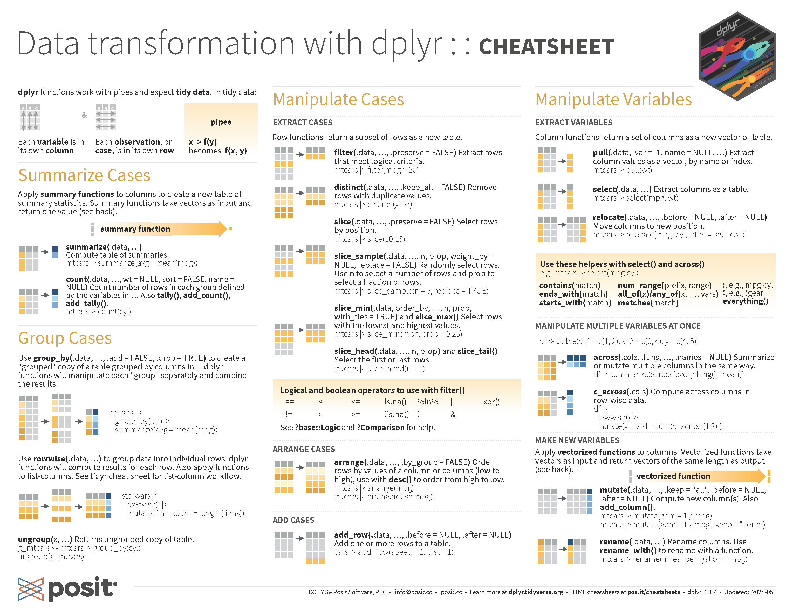
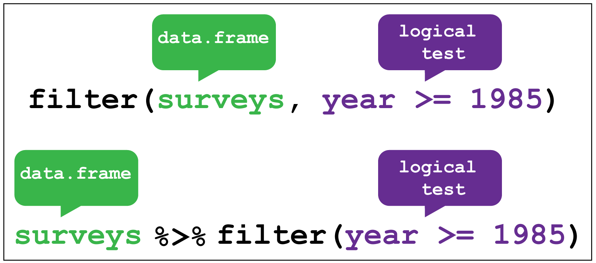
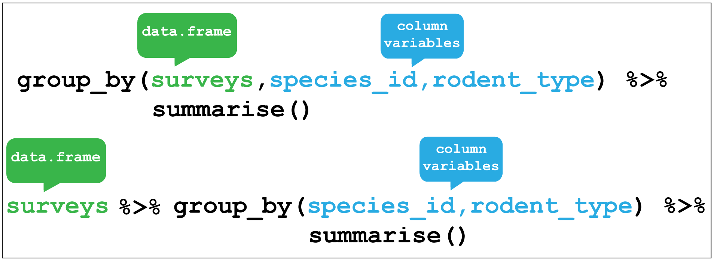
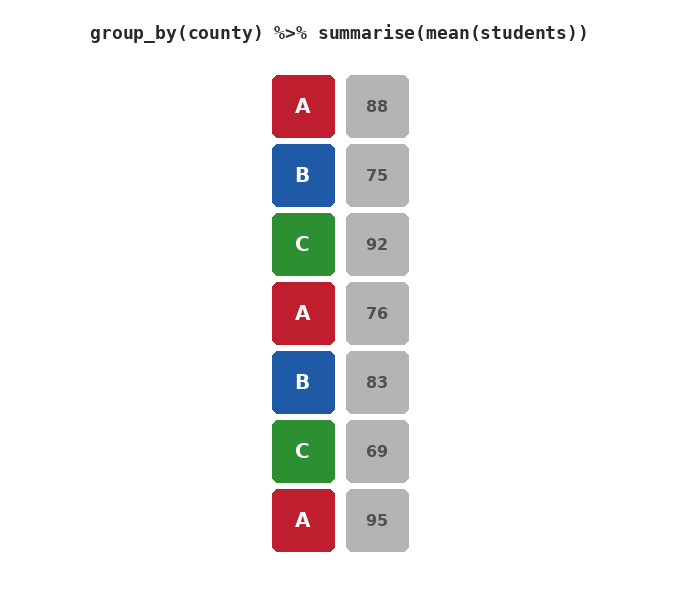

```{r}

```

layout: true
background-image: url(https://www.agec.ntu.edu.tw/uploads/asset/data/675f864c74ccc38a768f8254/%E6%9C%AA%E4%BE%86%E5%B1%95%E6%9C%9B%E5%9C%96%E7%89%87.png)
background-position: 98% 2%
background-size: 5%

```{r setup, include=FALSE}
library(knitr)
library(kableExtra)
library(dplyr)
library(ggplot2)
library(vistributions)
library(gginference)
setwd(dirname(rstudioapi::documentPath()))
options(htmltools.dir.version = FALSE)
knitr::opts_chunk$set(echo = TRUE, tidy = FALSE)
xaringanExtra::use_panelset()
xaringanExtra::use_clipboard()
xaringanExtra::use_extra_styles(hover_code_line = TRUE)
```
```{r xaringanExtra, echo = FALSE}
xaringanExtra::use_progress_bar(color = "#EFBE43", location = "bottom")
```
```{r xaringan-themer, include=FALSE, warning=FALSE}
library(xaringanthemer)
style_duo(
  # colors
  primary_color = "#FDF7E9",
  secondary_color = "#EFBE43",
  header_color = "#333333",
  text_color = "#333333",
  code_inline_color = colorspace::lighten("#333333"),
  text_bold_color = colorspace::lighten("#333333"),
  link_color = "#4466B0",
  title_slide_text_color = "#4466B0",

  # fonts
  header_font_google = google_font("Martel", "300", "400"),
  text_font_google = google_font("Lato"),
  code_font_google = google_font("Fira Mono")
)

style_extra_css(
  # 只針對段落 (p) 和列表 (li) 內的 `code`
  list(
    "p code, li code" = list(  
      "border" = "1px solid #F6DB96",
      "padding" = "2px 4px",
      "border-radius" = "4px"
      ),
    "ul ul" = list(
      "list-style-type" = "'▸'"  # 第二層使用三角形 (▸)
      ),
    "ul ul ul" = list(
      "list-style-type" = "'✔'"  # 第三層使用勾勾 (✔)
      ),
    # 置中
    ".middle_block" = list(
      "position" = "absolute",
      "top" = "50%",
      "left" = "50%", # 使與預設靠左距離相同
      "transform" = "translate(-50%, -50%)",
      "width" = "85%",              # 控制內文寬度（可調整）
      "text-align" = "left"         
      ),
    # 縮排
    ".indent" = list(
      "text-indent" = "2em"
      ),
    # 自動換行
    "pre code" = list(
      "white-space" = "pre-wrap",
      "word-wrap" = "break-word"
      ),
    "pre" = list(
      "border" = "none",
      "box-shadow" = "2px 2px 2px 2px #F7EEDA",
      "padding" = "0.1em",
      "background" = "none !important",
      "overflow-x" = "auto",
      "border-radius" = "1px"
      ),
    # 條列圖示顏色
    "li::marker" = list(
      "content" = "• ",
      "color" =  "#EFBE43"
      )
    )
  )

```


```{r, echo = FALSE}
options(servr.daemon = TRUE)
```


---
## Dplyr

#### [dplyr](https://dplyr.tidyverse.org/) 是 R 中資料前處理的強大套件，可以透過一系列清楚明瞭的語法，對資料進行 CRUD 的動作，同時結合獨特的 pipe operator （`%>%`），對於程式閱讀上來說更直觀、且學習時更容易上手。

```{r eval=FALSE}
# No matter what you’re thinking right now, install it first!
install.packages("dplyr")
```

- dplyr 套件中的 command 與 SQL 語法相當類似、操作邏輯雷同。

- 直觀的 command 讓程式碼更容易閱讀。

- 結合 pipeline 讓資料處理過程的邏輯更清晰且有效率。

- 屬於 [tidyverse](https://www.tidyverse.org/) 家族，可與其他實用的資料科學套件搭配使用，如：`ggplot2`、  `lubridate`、`purrr`、`stringr`、`tidyr`等等。

---
## Cheatsheet
```{r echo = FALSE, out.width="80%", fig.align='center'}

```
<p style="text-align: center;">圖片來源：<a href="https://github.com/rstudio/cheatsheets/blob/main/data-transformation.pdf">RStudio Github</a></p>

---
class: center, middle, inverse

### No more cheat sheets — just ask AI.

---
## Dplyr Highlights

```{r results='hide', eval=F}
library(dplyr)
```
.panelset[
.panel[.panel-name[main func.]
#### dplyr 主要 commands

- `select()`：選出 data 中想保留的欄位（column）。

- `filter()`：依照條件篩選符合的樣本（row）。

- `mutate()`：新增欄位，或修改已存在欄位的值。

- `group_by()`：依某個或多個欄位先把資料分組，**不會改變資料**。

- `arrange()`：按照指定欄位排序樣本。

- `summarise()`：數值型資料摘要統計結果。

]
.panel[.panel-name[other func.]
#### 其他 commands

- `slice()`：依照樣本的 index 取出指定樣本。

- `pull()`：將一欄位取出成向量，與 `$` 功能相同。

- `rename()`：修改欄位名稱。

- `left_join()`：依照共同欄位（key）將另一 data 資料水平合併。
]
]


---
## Dplyr
#### dplyr 是針對 data frame 進行資料處理的套件，操作有時會將資料結構轉換為 `tibble` （data frame 的一種，看起來也跟 data frame 一模一樣），因此須注意指令運行完後回傳的資料型態，如：即使 `select` 選取單行的情況之下，資料也不會降維（2 維變 1 維）。

```{r}
df <- read.csv("CASchools.csv")
```
```{r}
df <- group_by(df, county)
class(df)
```
#### 使用 dplyr commands 時，直接輸入欄位變數名稱，無須加上引號！

```{r}
df <- ungroup(df)
class(df)
```
---
## dplyr

#### `select()` 可選擇指定欄位（Columns），同時支援連續選取 `:`。

```{r}
df1 <- select(df, school, county, grades, students)
head(df1, n = 3)
```

```{r}
df1 <- select(df, school:students)
head(df1, n = 3)
```
---
## dplyr
#### `select()` 也能用與之前學習 index 方法時一樣，使用負號 `-` 進行欄位刪除的動作。
```{r}
df2 <- select(df1, -grades)
head(df2, n = 3)
```

```{r}
df2 <- select(df1, -(county:students))
head(df2, n = 3)
```
---
## dplyr
#### `filter()` 可選擇指定列位（Rows），搭配邏輯運算子篩選需要的資料。

```{r}
df3 <- filter(df, county == 'Butte')
head(df3, n = 3)
```

---
class: center, middle, inverse

### 學習寫程式到一個程度時，不能只滿足於執行完沒有 error 就結束，更要兼顧程式碼的可讀性。
#### 程式碼不容易閱讀時，除了看起來很醜外，與他人合作專案時頭也會很痛...

---
## %>% pipe
#### 當你需要經過一連串的操作來得到你想要的資料，在程式編譯上看起來可能會很凌亂。
```{r}
df4 <- filter(select(df, school:students), county == 'Butte')
head(df4, n = 3)
```

#### 這時候，使用 `%>%` pipe operator 就能使你的程式碼更容易閱讀及理解，甚至可以應用在非 dplyr 的指令上！

---
## %>% pipe

```{r echo = FALSE, out.width="70%", fig.align='center'}


```
<p style="text-align: center;">圖片來源：<a href="https://ab604.github.io/docs/bspr_workshop_2018/dplyr.html">British Society for Proteomic Research Meeting 2018</a></p>

---
## %>% pipe

#### 使用 pipe operator 將處理資料的指令依序串聯起來，程式碼看起來美觀且好理解多了。

```{r}
df %>% 
  select(school:students) %>%
  filter(county == 'Butte') %>%
  head(n = 3)
  
```

---
## dplyr
#### `mutate()` 可以建立一個新變數，並可以搭配其他 expression 或是 `ifelse` 等指令。

```{r}
df1 %>%
  mutate(student_mean = mean(students, na.rm = T)) %>%
  head()
```

---
## dplyr

#### `group_by()` 實際上並不會更改資料，而是將目前資料的向量運算改為先分組，再依據分組結果進行分組的向量運算。

```{r}
df1 %>%
  group_by(county) %>%
  head()
```
---
## dplyr

#### 如：我們想根據 county 進行分組，並建立一變數為各 county 的 students 平均數。

```{r}
df1 %>%
  group_by(county) %>%
  mutate(student_mean = mean(students, na.rm = T)) %>%
  head(n = 3)
```

---
## dplyr

#### `group_by()` 後，如果後續還需要進行資料清理或檢查，記得有個重要步驟是使用 `ungroup()` 將資料退回未分組前的狀態！
```{r}
df1 %>%
  group_by(county) %>%
  mutate(student_mean = mean(students, na.rm = T)) %>%
  ungroup() %>%
  head(n = 3)
```
---
## dplyr
#### `arrange()` 可以對指定欄位進行資料排序

```{r}
df1 %>%
  group_by(county) %>%
  mutate(student_mean = mean(students, na.rm = T)) %>%
  arrange(student_mean) %>%
  select(school, student_mean) %>%
  ungroup() %>%
  head(n = 4)
```

---
## dplyr
#### 處理完資料且分組完資料後，可以使用 `summarise()` 進行簡易的敘述性統計。

```{r echo = FALSE, out.width="55%", fig.align='center'}

```

---
## dplyr
#### 處理完資料且分組完資料後，可以使用 `summarise()` 進行簡易的敘述性統計。
```{r}
df1 %>%
  group_by(county) %>%
  summarise(county_n = n(), Mean = mean(students), Max = max(students))
```
---
class: center, middle, inverse


### 謝謝
#### 下周見
