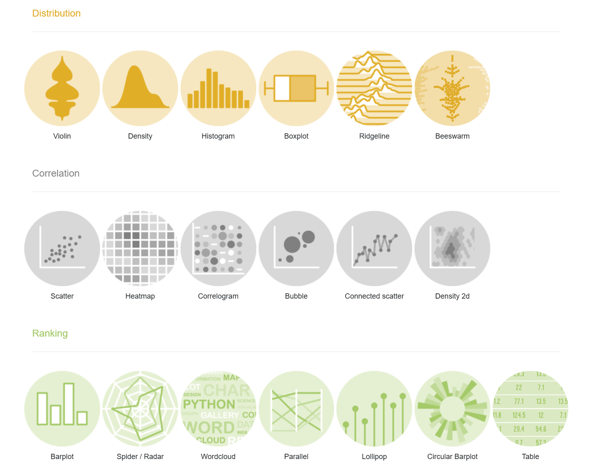
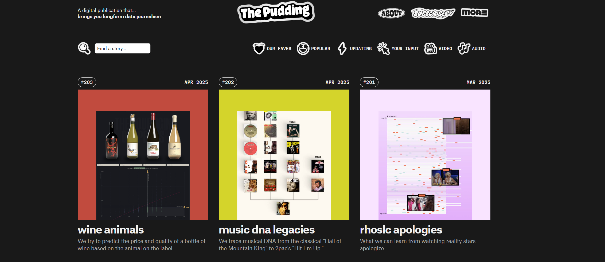

```{r}

```

layout: true
background-image: url(https://www.agec.ntu.edu.tw/uploads/asset/data/675f864c74ccc38a768f8254/%E6%9C%AA%E4%BE%86%E5%B1%95%E6%9C%9B%E5%9C%96%E7%89%87.png)
background-position: 98% 2%
background-size: 5%

```{r setup, include=FALSE}
library(knitr)
library(kableExtra)
library(dplyr)
library(ggplot2)
library(vistributions)
library(gginference)
setwd(dirname(rstudioapi::documentPath()))
options(htmltools.dir.version = FALSE)
knitr::opts_chunk$set(echo = TRUE, tidy = FALSE)
xaringanExtra::use_panelset()
xaringanExtra::use_clipboard()
xaringanExtra::use_extra_styles(hover_code_line = TRUE)
```
```{r xaringanExtra, echo = FALSE}
xaringanExtra::use_progress_bar(color = "#EFBE43", location = "bottom")
```
```{r xaringan-themer, include=FALSE, warning=FALSE}
library(xaringanthemer)
style_duo(
  # colors
  primary_color = "#FDF7E9",
  secondary_color = "#EFBE43",
  header_color = "#333333",
  text_color = "#333333",
  code_inline_color = colorspace::lighten("#333333"),
  text_bold_color = colorspace::lighten("#333333"),
  link_color = "#4466B0",
  title_slide_text_color = "#4466B0",

  # fonts
  header_font_google = google_font("Martel", "300", "400"),
  text_font_google = google_font("Lato"),
  code_font_google = google_font("Fira Mono")
)

style_extra_css(
  # 只針對段落 (p) 和列表 (li) 內的 `code`
  list(
    "p code, li code" = list(  
      "border" = "1px solid #F6DB96",
      "padding" = "2px 4px",
      "border-radius" = "4px"
      ),
    "ul ul" = list(
      "list-style-type" = "'▸'"  # 第二層使用三角形 (▸)
      ),
    "ul ul ul" = list(
      "list-style-type" = "'✔'"  # 第三層使用勾勾 (✔)
      ),
    # 置中
    ".middle_block" = list(
      "position" = "absolute",
      "top" = "50%",
      "left" = "50%", # 使與預設靠左距離相同
      "transform" = "translate(-50%, -50%)",
      "width" = "85%",              # 控制內文寬度（可調整）
      "text-align" = "left"         
      ),
    # 縮排
    ".indent" = list(
      "text-indent" = "2em"
      ),
    # 自動換行
    "pre code" = list(
      "white-space" = "pre-wrap",
      "word-wrap" = "break-word"
      ),
    "pre" = list(
      "border" = "none",
      "box-shadow" = "2px 2px 2px 2px #F7EEDA",
      "padding" = "0.1em",
      "background" = "none !important",
      "overflow-x" = "auto",
      "border-radius" = "1px"
      ),
    # 條列圖示顏色
    "li::marker" = list(
      "content" = "• ",
      "color" =  "#EFBE43"
      )
    )
  )

```


```{r, echo = FALSE}
options(servr.daemon = TRUE)
```


---
## plotting

.middle_block[
- 資料視覺化在資料科學中是一件相當重要的事情，透過圖表呈現資料的分布情形與關聯性，來闡述資料中的故事。

- 善用不同類型的統計圖表來呈現手中的數據，如：呈現資料占比時使用圓餅圖、呈現資料趨勢時使用折線圖。

- R 語言有許多 base plotting function，如：`plot()`、`pie()`、`barplot()`、`hist()`，可以簡單的用資料畫出折線圖、散布圖等等。

- R 語言在資料視覺化的呈現有相當優良的表現（`ggplot2`）。
]

---
## plotting

```{r echo = FALSE, out.width="75%", fig.align='center'}

```
<p style="text-align: center;">圖片來源：<a href="https://r-graph-gallery.com/">The R Graph Gallery</a></p>

---
## plotting

```{r out.width="50%", fig.align='center'}
x <- 1:10; y <- 1:10
plot(x, y, type = 'l')
```

---
## plotting

```{r out.width="50%", fig.align='center'}
plot(sin(1:100), col = rainbow(100), pch = 19)
```
---
## plotting

```{r out.width="50%", fig.align='center'}
x <- c("a", "b", "c", "d"); y <- c(8, 2, 9, 5)
barplot(y, names.arg = x)
```

---
## pudding

#### [The Pudding](https://pudding.cool/) 是以互動式與視覺化的方式呈現數據與故事的數位媒體，內容多以社會、文化等日常生活議題為主，與傳統媒體不一樣的是，這類資料視覺化的文章大多以圖表呈現而非文字，透過美觀的圖表與有趣的互動式網頁吸引讀者閱讀文章，其他主要媒體如：[Bloomberg Graphics](https://www.bloomberg.com/graphics)、[Reuters Graphics](https://www.reuters.com/graphics/) 也有類似的 data storytelling 文章。

```{r echo = FALSE, out.width="70%", fig.align='center'}

```
<p style="text-align: center;">圖片來源：<a href="https://pudding.cool/">The Pudding website</a></p>

---
## ggplot2

.middle_block[
- 一個基於 **Grammar of Graphics** 的資料視覺化套件，透過各個圖形元素（如資料、幾何圖形、統計轉換、比例、座標系等）以層層堆疊的方式組成一張圖形。

- 可以結合 `dplyr` 或其他 **tidyverse** 家族套件，將資料前處理與視覺化的流程清晰且直觀的建立出來。

- 可繪製各種類型統計圖表，如：散佈圖、長條圖、箱型圖、折線圖等，且容易對各圖層、圖形樣式與座標系統進行客製化調整。

- 即使使用預設設定輸出圖形也已經有最基礎的漂亮程度。
]

---
## ggplot2

```{r echo = FALSE, out.width="75%", fig.align='center'}
knitr::include_graphics("./gglayers.png")
```
<p style="text-align: center;">圖片來源：<a href="https://r.qcbs.ca/workshop03/book-en/grammar-of-graphics-gg-basics.html">QCBS R Workshop</a></p>
---
## ggplot2

&nbsp;
```{r eval=F}
library(ggplot2)
```
#### 根據前面各圖層內容與介紹並使用 `+` 堆疊圖層，ggplot 基礎操作步驟：

1. 使用 `ggplot()` 建立一個 ggplot 物件，並賦予此物件繪圖時使用之資料。

2. 使用 `geom_<幾何圖形類別>()` 選擇幾何圖形類別，此時可以決定圖形的座標軸（x, y）、幾何圖形顏色與樣式（Aesthetic），如：`geom_line()`、`geom_point()`等等。

3. 確認圖形統計計算的方式，如：次數、密度、比例等等，`ggplot2` 套件每個圖形皆有預設之統計方式。

4. 選擇或調整主題（Theme）、細節調整（Scales），如：`theme_minimal()`。

5. 更多內容可以參考 [ggplot2 package index](https://ggplot2.tidyverse.org/reference/index.html)。
---
## banknotes

#### 此資料來自於 [Who's in Your Wallets?](https://pudding.cool/2022/04/banknotes/)，其中記錄各國鈔票上所描繪的人物資料。

```{r}
notes <- read.csv("https://raw.githubusercontent.com/the-pudding/banknotes/master/src/data/banknotesData.csv")
```
```{r}
notes$country %>% n_distinct() # 共有 38 個國家
notes$name %>% n_distinct() # 共有 241 位人物
notes$profession %>% n_distinct() # 共有 15 種職業
```
---
## scatte plot 
#### `geom_point()` 散點圖可以簡單呈現兩個不同變數資料分布的狀態。
.panelset[
.pull-left[
```{r fig1, fig.show='hide'}
ggplot(notes, aes(x = firstAppearanceDate, y = currentBillValue)) +
  geom_point() +
  theme_minimal()
```
]
.pull-right[
```{r ref.label='fig1', echo = FALSE, out.width="80%", fig.align='center'}
```
]
]

---
## bar chart
#### `geom_bar()` 預設是計算次數，適合用在分組資料、非連續變數資料。

.panelset[
.pull-left[
```{r fig2, fig.show='hide'}
ggplot(notes, aes(x = profession)) +
  geom_bar(fill = "orange", width = 0.5) +
  labs(title = "", x = "", y = "") +
  theme_minimal() + 
  theme(
    axis.text.x = element_text(size = 8, angle = 45, hjust = 1) 
  )
```
]
.pull-right[
```{r ref.label='fig2', echo = FALSE, out.width="80%", fig.align='center'}
```
]
]

---
## bar chart
#### `tidyverse` 家族中的 `forcats` 套件可以對類別變數進行指定的排列。

.panelset[
.pull-left[
```{r fig3, fig.show='hide'}
library(forcats)
notes %>%
  distinct(name, profession) %>% 
  ggplot(aes(x = fct_rev(fct_infreq(profession)))) +
  geom_bar(fill = "orange", width = 0.5) +
  labs(title = "", x = "", y = "") +
  coord_flip() +
  theme_minimal() 
```
]
.pull-right[
```{r ref.label='fig3', echo = FALSE, out.width="80%", fig.align='center'}
```
]
]

---
## pie chart

#### `ggplot2` 本身沒有圓餅圖指令，需透過 `geom_bar()` 並將 stat 改為 `identity`。

.panelset[
.pull-left[
```{r fig4, fig.show='hide'}
notes %>%
  count(gender) %>%
    ggplot(aes(x = "", y = n, fill = gender)) +
    geom_bar(stat = "identity", width = 1) +
    coord_polar("y", start = 0) +
    scale_fill_manual(values = c("F" = "#FFD700", "M" = "#800020")) +
    theme_void()
```
]
.pull-right[
```{r ref.label='fig4', echo = FALSE, out.width="80%", fig.align='center'}
```
]
]

---
## histogram plot

#### 大部分的名人並沒有機會看到自己出現在鈔票上面。

```{r}
sum(notes$appearanceDeathDiff < 0, na.rm = T) * 100 /  length(notes$appearanceDeathDiff)
```


#### `geom_histogram()` 適合用在呈現連續變數資料，如：時間、價格或數量等等。

```{r fig5, fig.show='hide'}
ggplot(notes, aes(x = appearanceDeathDiff)) + 
  geom_histogram(fill="#69b3a2", binwidth = 20) +
  theme_minimal()
```
---
## histogram plot

```{r ref.label='fig5', echo = FALSE, warning=F, out.width="60%", fig.align='center'}
```
---
## line plot

#### `geom_line()` 折線圖適合用來呈現資料趨勢。

```{r fig6, fig.show='hide'}
notes %>%
  distinct(name, gender, firstAppearanceDate) %>%
  group_by(firstAppearanceDate, gender) %>%
  summarise(count = n(), .groups = "drop") %>%
  arrange(gender, firstAppearanceDate) %>%
  group_by(gender) %>%
  mutate(cumulative = cumsum(count)) %>%
  ggplot(aes(x = firstAppearanceDate,
             y = cumulative, color = gender)) +
  geom_line(linewidth = 1.5) + 
  scale_color_manual(values = c("F" = "#FFD700", "M" = "#800020"),
                     labels = c("Female", "Male")) + 
  theme_minimal()
```

---
## line plot
```{r ref.label='fig6', echo = FALSE, warning=F, out.width="60%", fig.align='center'}
```

---
## 課堂練習
#### 畫出 `firstAppearanceDate`（x 軸）vs `appearanceDeathDiff`（y 軸）的散點圖。

.panelset[
.panel[.panel-name[Question]
```{r eval=FALSE}
ggplot(notes, aes(x = ___, y = ___, color = gender)) +
  geom_point(alpha = 0.6)
  theme_minimal()
```

#### 注意 aes() 位置。
]
.panel[.panel-name[Ans]
.pull-left[
```{r fig_ex1, fig.show='hide'}
ggplot(notes, aes(x = firstAppearanceDate,
                  y = appearanceDeathDiff,
                  color = gender)) +
  geom_point(alpha = 0.6) +
  theme_minimal()
```
]
.pull-right[
```{r ref.label='fig_ex1', echo = FALSE, warning = F, out.width="80%", fig.align='center'}
```
]
]
]

---
## boxplot
#### `geom_boxplot()` 通常用來比較資料中不同群體的分布情況

.panelset[
.pull-left[
```{r fig7, fig.show='hide'}
ggplot(notes, aes(x = gender, y = currentBillValue, fill = gender)) + 
  geom_boxplot() + 
  scale_fill_manual(values = c("F" = "#FFD700", "M" = "#800020"),
                    labels = c("Female", "Male")) +
  theme_minimal()
```
]
.pull-right[
```{r ref.label='fig7', echo = FALSE, out.width="80%", fig.align='center'}
```
]
]

---
## boxplot
#### 如果資料中有離群值，設定 y 軸範圍或移除離群值
.panelset[
.panel[.panel-name[y limit]
.pull-left[
```{r fig8, fig.show='hide'}
ggplot(notes, aes(x = gender, y = currentBillValue, fill = gender)) + 
  geom_boxplot(outlier.shape = NA) + 
  scale_fill_manual(values = c("F" = "#FFD700", "M" = "#800020"),
                    labels = c("Female", "Male")) +
  coord_cartesian(ylim = c(0, 2500)) +
  theme_minimal()
```
]
.pull-right[
```{r ref.label='fig8', echo = FALSE, out.width="80%", fig.align='center'}
```
]
]
.panel[.panel-name[remove outlier]
.pull-left[
```{r fig9, fig.show='hide'}
ggplot(notes, aes(x = gender, y = currentBillValue, fill = gender)) + 
  geom_boxplot(outliers = FALSE) + 
  scale_fill_manual(values = c("F" = "#FFD700", "M" = "#800020"),
                    labels = c("Female", "Male")) +
  theme_minimal()
```
]
.pull-right[
```{r ref.label='fig9', echo = FALSE, out.width="90%", fig.align='center'}
```
]
]
]

---
## more setting
#### 也可以透過 ggplot2 各種設定畫出類似網站上面的圖表。
```{r eval = FALSE, results='asis'}
ggplot(gender_data, aes(x = "Banknote Figures", y = percent_plot, fill = gender)) + geom_col(width = 0.3, color = "white", size = 2) + geom_text(aes(label = label), position = position_stack(vjust = 0.5),size = 3.5, fontface = "bold", vjust = 8) +
  scale_fill_manual(values = c("M" = "#800020", "F" = "#FFD700")) +
  coord_flip() + theme_minimal() + labs(title = NULL, x = NULL, y = NULL) + theme(axis.text.y = element_blank(), axis.text.x = element_blank(), panel.grid.major = element_blank(), panel.grid.minor = element_blank(), legend.position = "none", plot.background = element_rect(fill = "transparent", colour = NA), panel.background = element_rect(fill = "transparent", colour = NA))
```


---
## Summary

.middle_block[
- 使用 ggplot2 製作完統計圖表後可以用 `ggsave()` 或手動儲存成圖片。

- 每個統計圖表都有其特定用途，必須根據資料與你想要呈現的內容來選擇。

- 透過適當的圖表設計，資料的價值能被更快速且有效地傳遞給聽眾。
]
---
class: center, middle, inverse


### 謝謝
#### 下周見